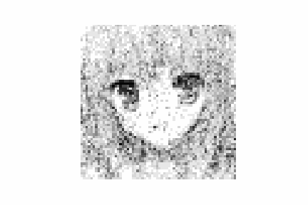
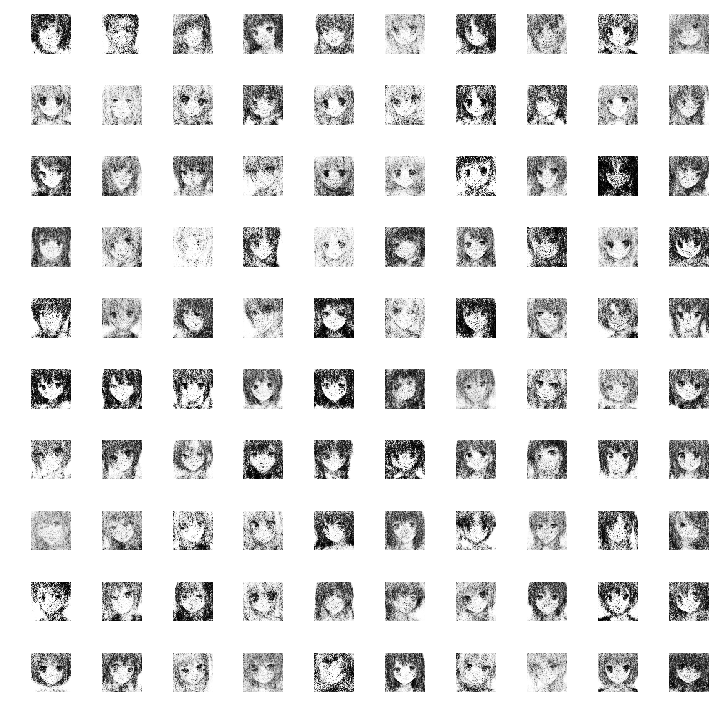

# Anime-Face-Generator-GANs
Annie Face Image Generator Using GANsㄱ

### 설명
처음하는 GANs를 이용해서 하는 프로젝트 입니다.
높은수준이 아니지만 공부를 목적으로 하고 있기에 차후에 더나은 프로젝트로 돌아오겠습니다.

### 사용한 데이터셋
https://www.kaggle.com/soumikrakshit/anime-faces
Kaggle의 데이터셋을 이용하였습니다.

This `project` directory should look like:

    Anime-Face-Generator-GANs
    ├── gans.ipynb
    ├── sample
    │   ├── animation_???.mp4
    │   ├── animation_???.gif
    │   ├── gan_generated_image_epoch_600.png
    │   └── ...
    ├── dataset
    │   ├── ???.jpg
    │   ├── ???.png
    │   └── ...
    └── model_data
        ├── discriminator_weight.h5
        ├── gan_weight.h5
        ├── generator_weight.h5
        ├── discriminator.json
        ├── gan.json
        └── generator.json

